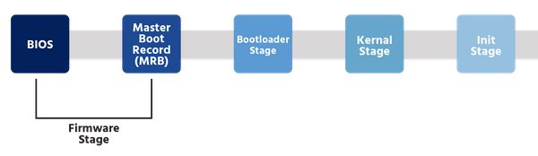

# Chapter 14: Network Configuration

<details>

<summary>Key terms</summary>

`/etc/hostname` System file containing the name of the current host

`/etc/hosts` System file used to translate hostnames to an IP addresses.

`/etc/nsswitch.conf` The name service switch file that contains information about which source the resolver should use to look up for information. This file is used for configuring the lookup for different categories of information such as user name, group names ,host names and network names. This file also defines the order of preference of different sources.

`/etc/resolv.conf` The configuration file for DNS resolvers

`hostname` The hostname command is used to set and view the system's host and domain name.

`hostnamectl` Used to query and set system hostnames, but the hostnamectl command provides additional categories for hostnames; static, pretty, and transient

`ifconfig` Command used to view and configure network interfaces

`nmcli` NetworkManager uses the network management command line interface nmcli to manage network connections and display information about devices on a network&#x20;

</details>

## Introduction

The system administrator needs to know how to configure the system for network access.

## TCP/IP Configuration

Recall that the _**Transmission Control Protocol (TCP)**_** is a connection-oriented** service between two applications exchanging data. To configure a network port, or interface, on legacy systems, use the <mark style="color:red;">`ifconfig`</mark> <mark style="color:red;"></mark><mark style="color:red;"></mark> command.

> The <mark style="color:red;">`ifconfig`</mark> <mark style="color:red;"></mark><mark style="color:red;"></mark> command stands for interface configuration and is used to display network configuration information

This command is used for the following functions:

* Assigning static IP address
* Viewing current network configuration
* Setting the netmask
* Setting the broadcast address
* Enable/disable network interfaces

The <mark style="color:red;">`ifconfig`</mark> <mark style="color:red;"></mark><mark style="color:red;"></mark> command can be used without options or arguments to display all interfaces on the network, or with options and an interface name as an argument.

```bash
ifconfig [INTERFACE] [OPTIONS]
```

```bash
root@localhost:~ ifconfig                                     
eth0      Link encap:Ethernet  HWaddr b6:84:ab:e9:8f:0a    
          inet addr:192.168.1.2  Bcast:0.0.0.0  Mask:255.255.255.0  
          inet6 addr: fe80::b484:abff:fee9:8f0a/64 Scope:Link       
          UP BROADCAST RUNNING MULTICAST  MTU:1500  Metric:1        
          RX packets:95 errors:0 dropped:4 overruns:0 frame:0       
          TX packets:9 errors:0 dropped:0 overruns:0 carrier:0      
          collisions:0 txqueuelen:1000                              
          RX bytes:25306 (25.3 KB)  TX bytes:690 (690.0 B)          
lo        Link encap:Local Loopback                               
          inet addr:127.0.0.1  Mask:255.0.0.0                       
          inet6 addr: ::1/128 Scope:Host                           
          UP LOOPBACK RUNNING  MTU:65536  Metric:1                  
          RX packets:6 errors:0 dropped:0 overruns:0 frame:0        
          TX packets:6 errors:0 dropped:0 overruns:0 carrier:0      
          collisions:0 txqueuelen:0                                 
          RX bytes:460 (460.0 B)  TX bytes:460 (460.0 B)
```


The `lo` device is referred to as the loopback device. It is a special network device used by the system when sending network-based data to itself.


To view the details of a specific interface, execute the following command:

```bash
sysadmin@localhost:~$ ifconfig eht0                                  
eth0: flags=4163<UP,BROADCAST,RUNNING,MULTICAST>  mtu 1450            
        inet 192.168.1.2  netmask 255.255.255.0  broadcast 0.0.0.0              
        inet6 fe80::42:c0ff:fea8:102  prefixlen 64  scopeid 0x20<link>          
        ether 02:42:c0:a8:01:02  txqueuelen 0  (Ethernet)                       
        RX packets 13  bytes 1038 (1.0 KB)                                      
        RX errors 0  dropped 0  overruns 0  frame 0                             
        TX packets 8  bytes 648 (648.0 B)                                       
        TX errors 0  dropped 0 overruns 0  carrier 0  collisions 0
```

To assign an IP address to an interface, execute the following:

```bash
sudo ifconfig eth0 192.168.1.3
```

To assign a netmask to an interface, execute the following:

```bash
sudo ifconfig eth0 netmask 255.255.255.192
```

To assign a broadcast address to an interface, execute the following:

```bash
sudo ifconfig eth0 broadcast 192.168.1.63
```

The `ifconfig` command can be used to enable and disable an interface. To disable (deactivate) a network interface, execute the following command:

```bash
sudo ifconfig eht0 down
```

To view the changes that were made, execute the following:

```bash
sysadmin@localhost:~$ ifconfig eth0                                 
eth0: flags=4163<BROADCAST,MULTICAST>  mtu 1450                      
        inet 192.168.1.2  netmask 255.255.255.0  broadcast 0.0.0.0              
        inet6 fe80::42:c0ff:fea8:102  prefixlen 64  scopeid 0x20<link>          
        ether 02:42:c0:a8:01:02  txqueuelen 0  (Ethernet)                       
        RX packets 13  bytes 1038 (1.0 KB)                                      
        RX errors 0  dropped 0  overruns 0  frame 0                             
        TX packets 8  bytes 648 (648.0 B)                                       
        TX errors 0  dropped 0 overruns 0  carrier 0  collisions 0
```

Note from the output above that the `eth0` interface is no longer `UP` and `RUNNING` .

To enable (activate) a network interface, execute the following:

```bash
sudo ifconfig eth0 up
```


The <mark style="color:red;">`ifconfig`</mark>command can also be used to modify network settings temporarily. Typically these changes should be permanent.


### Setting the Hostname

The hostname is used to identify the system by applications such as web servers.

> On Debian-derived and modern Red Hat-derived systems, the `/etc/hostname` file contains this information, while legacy Red Hat-derived systems store this information in the `/etc/sysconfig/network` file. This file is read at boot time to set the hostname

The <mark style="color:red;">`hostname`</mark> <mark style="color:red;"></mark><mark style="color:red;"></mark> command is used to set and view the system's host and domain name. To view the currently assigned hostname of the system, execute the `hostname` or short name cut at the first dot <mark style="color:red;">`hostname -s`</mark>, or full domain name <mark style="color:red;">`hostname -f`</mark> command:

```bash
sysadmin@localhost:~$ hostname -s
localhost

sysadmin@localhost:~$ hostname -f
test.example.com
```

> The name displayed above is returned by the `gethostname()` application programming interface (API)


Note that setting the hostname using the <mark style="color:red;">`hostname`</mark> <mark style="color:red;"></mark><mark style="color:red;"></mark> command results in a change that is only persistent until the next system boot.


The `/etc/hosts` file is used for mapping hostnames with IP addresses. It is a flat-fole with one record on each line. The format of the file is:

```bash
IP Address    Host Name    Alias
127.0.0.1      localhost
192.168.4.8    apps.sample.com      apps
192.168.4.12   vm1.sample.com       vm1
```

The `Alias` filed is used for mapping short names or labels to a host.

The functionality of the `/etc/hosts` file has been relegated by DNS but is still used in the following situations:

* **Bootstrapping**: This file is **referred to during system startup** since the DNS service is not started at this point.
* **Isolated nodes:** If a **node is not connected to the internet**, it is unlikely to use DNS. The `/etc/hosts` file is useful for such nodes.
* **NIS**: The records in the hosts file are **used as input for the NIS** (Network Information Services) database.

**`Systemd` systems use an alternative to the **<mark style="color:red;">**`hostname`**</mark><mark style="color:red;">** **</mark><mark style="color:red;">****</mark>** command, the **<mark style="color:red;">**`hostnamectl`**</mark><mark style="color:red;">**  **</mark><mark style="color:red;">****</mark>**  command**. Similar to the <mark style="color:red;">`hostname`</mark> <mark style="color:red;"></mark><mark style="color:red;"></mark> command, the <mark style="color:red;">`hostnamectl`</mark> <mark style="color:red;"></mark><mark style="color:red;"></mark> command can also be used to query and set system hostnames, bu the `hostnamectl` provides additional categories for hostnames: _static_, _pretty_, and _transient_ which are described below:

* **Static**: A static hostname is limited to \[a-z], \[0-9], hyphen `-` , and period `.` characters (no spaces). This hostname is stored in the `/etc/hostname` file. Can be set by a user.
* **Pretty**: Hostname can be in human-readable format **using any valid UTF-8 characters** and can include special characters.
* **Transient**: Is a dynamic hostname usually **set by the kernel to `localhost` by default**. A dynamic hostname can be modified if needed. The transient hostname can be modified by DHCP or mDNS at runtime.

To demonstrate, in order to **view the current hostname**, simply use the <mark style="color:red;">`hostnamectl`</mark> <mark style="color:red;"></mark><mark style="color:red;"></mark> commnad by itself or with the <mark style="color:red;">**`status`**</mark><mark style="color:red;">** **</mark><mark style="color:red;">****</mark> subcommand:

```bash
sysadmin@localhost:~$ hostnamectl status 
      Static hostname: localhost
            Icon name: computer-vm
              Chassis: vm
           Machine ID: 5b91eb5e50594030b48b28f103cf5cd6
              Boot ID: c04fc73d939a4fc18b279cd46d08f8d7
       Virtualization: kvm
     Operating System: Ubuntu 18.04.2 LTS
               Kernel: Linux 4.15.0-45-generic
         Architecture: x86-64
```

To **change the local machine hostname**, use the <mark style="color:red;">`hostnamectl`</mark> <mark style="color:red;"></mark><mark style="color:red;"></mark> command with the <mark style="color:red;">**`set-hostname`**</mark>** option**, this must be done with elevated permissions:

```bash
sysadmin@localhost:~$ sudo hostnamectl set-hostname netlab01
[sudo] password for sysadmin:
sysadmin@localhost:~$ hostnamectl status
      Static hostname: netlab01 
            Icon name: computer-vm
              Chassis: vm
           Machine ID: 5b91eb5e50594030b48b28f103cf5cd6
              Boot ID: c04fc73d939a4fc18b279cd46d08f8d7
       Virtualization: kvm
     Operating System: Ubuntu 18.04.2 LTS
               Kernel: Linux 4.15.0-45-generic
         Architecture: x86-64
```

### Configuring DNS

The DNS (Domain Name System) is the mapping table for the internet, allowing any computer or device to access websites, mail servrs, etc. by using a name instead of an IP address.

The `/etc/resolv.conf` file is the configuration for DNS resolvers. The information in this file is normally set up by network initialization scripts.

A sample `/etc/resolv.conf` file looks like the following:

```bash
# /etc/resolv.conf           
domain        sample.com
search        sample.com           
# central nameserver
nameserver    191.74.10.12
 
sortlist 191.74.10.0 191.74.40.0
```

The format of the `/etc/resolv.conf` is:

```
directive    value1, value2…
```

The configuration directives used in this file are:

| Option       | Meaning                                                                                                                                                                        |
| ------------ | ------------------------------------------------------------------------------------------------------------------------------------------------------------------------------ |
| `nameserver` | IP address of the name server that the resolver will use. Maximum of 3 servers can be listed                                                                                   |
| `domain`     | Domain name to be used locally                                                                                                                                                 |
| `search`     | Search list to be used for hostname lookup                                                                                                                                     |
| `sortlist`   | <p>Allow addresses to be sorted</p><p>The list is specified by IP addresses and optionally the netmask</p>                                                                     |
| `options`    | <p>Used to modify the resolver’s internal variables using certain keywords</p><p>E.g. <code>attempts: 3</code> will set the retry count for querying the name servers to 3</p> |

### Name Service Switch

The name service switch (NSS) is used by the system administrator to **specify which name information source** (i.e, local files, LDAP) **to use for different categories** (i.e, `passwd`, `shadow`, `hosts`,etc), and in which order the sources are searched.

The client applications query the name service database using APIs such as:

* `gethostbyname()`
* `getaddrinfo()`
* `getnetent()`&#x20;

The <mark style="color:orange;">`/etc/nsswitch.conf`</mark> file is **used to store the information used for name service switching.** It is a text file with columns that contain the following information:

* Database name
* Lookup order of sources
* Actions permitted for the lookup result

A process that needs to lookup host or network-related information will refer to the configuration for the required database in this file.

A sample portion of an <mark style="color:orange;">`/etc/nsswitch.conf`</mark> file will look like the following:

```bash
sysadmin@localhost:~$ cat /etc/nsswitch.conf                                    
...                                                            
passwd:         compat                                                          
group:          compat                                                          
⁠⁠ 
...
hosts:          files dns                                                       
networks:       files                                                           
...
```

The first column **contains the database name, followed by the services to be queried in the order of their occurences** in the file.

For example, the current sample of the <mark style="color:orange;">`/etc/nsswitch.conf`</mark> file demonstrates the `hosts` database service configured like the following:

```
host     files dns
```

When a hostname lookup is performed, the `files` entry will make use of the `/etc/hosts` file to perform the resolving. If the query does not return any results, then the query will be sent to the DNS resolver (`/etc/resolv.conf` )

By changing the order of the name services listed for a particular database, like `hosts` ,the administrator could change whether the local `/etc/hosts` file is consulted before or after the DNS servers listed in `/etc/resolv.conf`&#x20;

```
hosts:        dns files
```

In the event of the query not returning any results, specific actions can also be mentioned in the `/etc/nsswitch.conf` file.

```bash
hosts:        dns [NOTFOUND=return] files
```

In the above example, the DNS resolver will try to resolve the hostname. If a match is not found, then the resolver will immediately return `NOTFOUND` status and the `/etc/hosts` file will  not be queried.

### Configuring Routing Tables

The `route` command is used to view, as well as update, the IP routing table.


Any system using the TCP/IP protocol to send network packets will have a routing table. **The routing function is managed by the IP layer**. The routing table will decide the forwarding IP address for the packet.


Static routes in the kernel's routing table can be set using the `route` command. To view the current routing table, execute the following command:

```bash
sysadmin@localhost:~$ route 
Kernel IP routing table                                                         
Destination     Gateway         Genmask         Flags Metric Ref    Use Iface   
192.168.1.0     *               255.255.255.192 U     0      0        0 eth0    
192.168.1.0     *               255.255.255.0   U     0      0        0 eth0
```

The fields in the output are as follows:

| Option        | Meaning                                                                                                                                                                       |
| ------------- | ----------------------------------------------------------------------------------------------------------------------------------------------------------------------------- |
| `Destination` | Destination host or network                                                                                                                                                   |
| `Gateway`     | <p>IP address of the gateway</p><p><code>0.0.0.0</code> means “no route, broadcast on this network”</p>                                                                       |
| `Genmask`     | <p>Subnet mask for the destination network</p><p>Set to <code>0.0.0.0</code> for the default route</p>                                                                        |
| `Flags`       | <p>Values include <code>C</code> (cache entry), <code>G</code> (use gateway) and <code>U</code> (up)</p><p>For more options, refer to the man page for <code>route</code></p> |
| `Metric`      | Number of hops to the target, used as a measure of distance                                                                                                                   |
| `Ref`         | Number of references to this route; this is not used in Linux                                                                                                                 |
| `Use`         | Count of lookups done for this route                                                                                                                                          |
| `Iface`       | Interface to use for sending packets for this route                                                                                                                           |

If an administrator wants to add a route, they must specify a gateway which is connected to a network that one of the system's interfaces is on. If an attempt is made to add a route that will be unsuable due to an ureachable gateway, then it will be ignored and an error will be displayed.

For example, because the `eth0` interface in the previous example is on the `192.168.1.0-63` network, any routes that get added for this interface must use a router on that network.

For instance, to be able to reach the `192.56.78.0/24` network, a router like `192.168.1.0` could be used, if that machine is connected to both network (it would likely have two network interfaces).

To **add this route to the `eth0` interface**, the administrator could execute the following `sudo` command.

```bash
sudo route add -net 192.56.78.0 netmask 255.255.255.0 gw 192.168.1.1 dev eth0
```

To view the changes in the routing table, execute the following command:

```bash
sysadmin@localhost:~$ route                                                     
Kernel IP routing table                                                         
Destination     Gateway         Genmask         Flags Metric Ref    Use Iface   
192.56.78.0     192.168.1.1     255.255.255.0   UG    0      0        0 eth0    
192.168.1.0     *               255.255.255.192 U     0      0        0 eth0    
192.168.1.0     *               255.255.255.0   U     0      0        0 eth0    
```

To **add a default gateway**, execute the following command:

```bash
sudo route add default gw 192.168.1.1
```

To view the changes in the routing table, execute:

```bash
sysadmin@localhost:~$ route                                                     
Kernel IP routing table                                                         
Destination     Gateway         Genmask         Flags Metric Ref    Use Iface   
default         192.168.1.1     0.0.0.0         UG    0      0        0 eth0    
192.56.78.0     192.168.1.1     255.255.255.0   UG    0      0        0 eth0    
192.168.1.0     *               255.255.255.192 U     0      0        0 eth0    
192.168.1.0     *               255.255.255.0   U     0      0        0 eth0    
```

To verify the connectivity to a network that is now available via the new route, execute the `ping` command.

```
sysadmin@localhost:~$ ping 192.168.1.1
```

If the `ping` command is working correctly, then the gateway has been configured correctly.

To **view the kernel's cached routing information**, execute the <mark style="color:red;">`route`</mark> <mark style="color:red;"></mark><mark style="color:red;"></mark> command with <mark style="color:red;">`-Cn`</mark> option:

```bash
sysadmin@localhost:~$ route -Cn                                                 
Kernel IP routing cache                                                         
Source          Destination     Gateway         Flags Metric Ref    Use Iface  
```

If a **setup is required where a particular host is blocked** when packets are routed, then execute the command:

```bash
sudo route add host 192.168.1.62 reject
```

> This will make the host unreachable.

To delete a route from the routing table, an administrator can execute a command like the one that added it, except using `del` instead of `add`&#x20;

```bash
sudo route del -net 192.56.78.0 netmask 255.255.255.0 gw 192.168.1.1 dev eth0
sudo route del default gw 192.168.1.1
```

## Network Interfaces

The term _network interface_ refers to the point of connection between a computer and a network. It can be implemented in either hardware or software. The _network interface card (**NIC**)_ is an example of the **hardware interface**, while the **loopback** interface (`127.0.0.1`) is an example of the **software interface.**

### Network Interface Configuration

**The linux system comes with default drivers for the general network interfaces.** If the NIC can be loaded using the defautl driver, then it will be detected during initialization. If the NIC is not supported by the default driver, then the driver will have to be loaded into the kernel before the card can be used.

For example, by performing some research, the administrator has determined that the driver or kernel module that is needed for a network interface is called `veth` . To manually load this driver, execute the following `sudo` command:

```bash
sysadmin@localhost:~$ sudo modprobe veth
```

To view information about the driver, the list hardware `lshw` command can be used:

```bash
sysadmin@localhost:~$ sudo lshw -c network | grep veth
configuration: autonegotiation=off broadcast=yes driver=veth driverversion=1.0 duplex=full ip=192.168.1.2 link=yes multicast=yes port=twisted pair speed=
10Gbit/s
```

To verify if the driver has been loaded correctly, execute the following command:

```
sysadmin@localhost:~$ lsmod | grep veth                                         
veth                   12390  0
```

If the details of the driver are shown, then the driver has been successfully installed, and the new interface card `eth1` can be viewed using the `ifconfig` command:

```bash
sysadmin@localhost:~$ ifconfig eth1                                           
eth1      Link encap:Ethernet  HWaddr 08:00:27:CB:F3:51  
          inet6 addr: fe80::a00:27ff:fecb:f351/64 Scope:Link
          UP BROADCAST RUNNING MULTICAST  MTU:1500  Metric:1
          RX packets:0 errors:0 dropped:0 overruns:0 frame:0
          TX packets:19 errors:0 dropped:0 overruns:0 carrier:0
          collisions:0 txqueuelen:1000 
          RX bytes:0 (0.0 b)  TX bytes:4914 (4.7 KiB)
```

This output indicates that `eth1` has been recognized by the system. The next step is to configure and assing an IP address to `eth1` . To temporarily assign the IP address `192.168.10.12` to the `eth1` device, execute the following command:

```
sudo ifconfig eth1 192.168.10.12 netmask 255.255.255.0
```

To verify if the NIC is working correctly, execute the `ifconfig eht1` command:

```
sysadmin@localhost:~$ ifconfig eth1
eth1      Link encap:Ethernet  HWaddr 08:00:27:CB:F3:51  
          inet addr:192.168.81.12  Bcast:192.168.81.255 
       Mask:255.255.255.0
          inet6 addr: fe80::a00:27ff:fecb:f351/64 Scope:Link
          UP BROADCAST RUNNING MULTICAST  MTU:1500  Metric:1
          RX packets:0 errors:0 dropped:0 overruns:0 frame:0
          TX packets:34 errors:0 dropped:0 overruns:0 carrier:0
          collisions:0 txqueuelen:1000 
          RX bytes:0 (0.0 b)  TX bytes:9008 (8.7 KiB)
```

The `UP` status indicates that the interface has been enabled and the `RUNNING` status indicates that the configuration of the interface is complete and it is operational.

Some of the fields in the output significant for analyzing networks errors are:

| Option          | Meaning                                                                                                |
| --------------- | ------------------------------------------------------------------------------------------------------ |
| `RX errors`     | Number of received packets which were damaged                                                          |
| `RX dropped`    | Number of packets dropped due to reception errors                                                      |
| `RX overruns`   | Number of received packets which experienced data overrun                                              |
| `RX frame`      | Number of received packets which experienced frame errors                                              |
| `TX errors`     | Number of packets which experienced data transmission errors                                           |
| `TX dropped`    | Number of packets dropped due to transmission errors                                                   |
| `TX overruns`   | Number of transmitted packets which experienced data overrun                                           |
| `TX carriers`   | Number of transmitted packets which experienced loss of carriers                                       |
| `TX collisions` | Number of transmitted packets which experienced Ethernet collisions possibly due to network congestion |

### Red Hat Interface Configuration

On legacy **Red Hat-derived** system, the <mark style="color:orange;">`/etc/sysconfig/network`</mark> file **contains host and routing details for all configured network interfaces**. A sample file would look like the following:

```bash
NETWORKING=yes
HOSTNAME=gsource1.localdomain
GATEWAY=192.168.122.1
```

**For each network interface, there is a corresponding interface configuration script file **<mark style="color:orange;">**`/etc/sysconfig/network-scripts/ifcfg-<interface-name>`**</mark> . A network interface can have its settings automatically assigned via a DHCP server or statically within this file.

Any `GATEWAY` specified in an interface configuration file would override the `GATEWAY` specified in the `/etc/sysconfig/network` file.&#x20;

A sample file `/etc/sysconfig/network-scripts/icfg-eth0` for the `eth0` device where the **interface is configured automatically** via DHCP would look like the following:

```bash
DEVICE="eth0"        # name of the device
NM_CONTROLLED="no"    # device is not NetworkManager managed
ONBOOT=yes        # activate interface automatically
TYPE=Ethernet        # type of interface
BOOTPROTO=dhcp        # use a DHCP to configure interface
```

On a Red Hat-derived system, a **static configuration** of the <mark style="color:orange;">`/etc/sysconfig/network-scripts/icfg-eth0`</mark> file would look like the following:

```bash
DEVICE="eth0"        # name of the device
NM_CONTROLLED="no"    # device is not NetworkManager managed
ONBOOT=yes        # activate interface automatically
TYPE=Ethernet        # type of interface
⁠⁠ 
BOOTPROTO=none        # use static configuration 
IPADDR=192.168.0.3    # set the IP address
NETMASK=255.255.255.0    # set the subnet mask
GATEWAY=192.168.0.1    # set the default router
DNS1=192.168.0.254    # set the primary DNS server
```

### Debian Interface Configuration

For Debian-derived systems, the <mark style="color:orange;">**`/etc/network/netplan`**</mark> directory **contains files that are used to configure the interfaces**.&#x20;

A sample `*.yaml` (YAML Ain't Markup Language) human-readable file for an **interface that uses DHCP** for address configuration would look like the following:

```bash
# This file describes the network interfaces available on your system
# For more information, see netplan(5).
network:
    version: 2
    renderer: networkd
    ethernets:
        ens3:
            dhcp4: yes
```

A sample interfaces file for using **static addresses** would look like the following:

```bash
network:
  version: 2
  renderer: networkd
  ethernets:
    eth0:
      addresses:
        - 10.10.10.2/24
      gateway4: 10.10.10.1
      nameservers:
          search: [mydomain, otherdomain]
          addresses: [10.10.10.1, 1.1.1.1]
```

### NetworkManager

Originally developed by Red Hat, _NetworkManager_ **provides automatic detection and configuration of network interfaces** on a Linux system. It works for both wired and wireless interfaces as well as having support for some modems and VPN connections.

The NetworkManager service is a **GNOME project**. NetworkManager **provides a graphical utility for configuring network interfaces.**

_NetworkManager_ uses the network management command line interface <mark style="color:red;">`nmcli`</mark> <mark style="color:red;"></mark><mark style="color:red;"></mark> tool to **manage network connections and display information about devices on a network**. The <mark style="color:red;">`nmcli`</mark> <mark style="color:red;"></mark><mark style="color:red;"></mark> command uses the following syntax:

```bash
nmcli [OPTIONS] OBJECT [COMMAND][ARGUMENTS...]
```

The `OPTIONS` for the <mark style="color:red;">`nmcli`</mark> <mark style="color:red;"></mark><mark style="color:red;"></mark> command can be found by visiting the <mark style="color:red;">`nmcli`</mark> <mark style="color:red;"></mark><mark style="color:red;"></mark> man page or by using the <mark style="color:red;">`nmcli --help`</mark> command.

Commonly used options include the _terse_ <mark style="color:red;">**`-t`**</mark> option that **display concise output** and the pretty <mark style="color:red;">`-p`</mark> option, which **makes the output easily readable** by printing headers and aligning values.

The `OBJECT` field can be one of the following:

| Object                                       | Meaning                                                                        |
| -------------------------------------------- | ------------------------------------------------------------------------------ |
| <mark style="color:red;">`general`</mark>    | Display information about or modify the **status** of NetworkManager.          |
| <mark style="color:red;">`networking`</mark> | Display information about or modify the **network managed** by NetworkManager. |
| <mark style="color:red;">`connection`</mark> | Display information about or modify **connections managed** by NetworkManager. |
| <mark style="color:red;">`device`</mark>     | Display information about or modify **devices managed** by NetworkManager.     |
| <mark style="color:red;">`radio`</mark>      | Display the **status of, and enable or disable, the radio switches**.          |

To demonstrate, the following command can be used to show the existing network device:

```bash
[sysadmin@centos ~]$ nmcli device
DEVICE  TYPE      STATE      CONNECTION
ens3    ethernet  connected  eth0
```


When using the <mark style="color:red;">`nmcli`</mark> <mark style="color:red;"></mark><mark style="color:red;"></mark> command, the object can be abbreviated. For example, the <mark style="color:red;">`nmcli device`</mark> command used  can be shortened to <mark style="color:red;">`nmcli dev`</mark> <mark style="color:red;"></mark><mark style="color:red;"></mark> or <mark style="color:red;">`nmcli d`</mark>&#x20;


**The **<mark style="color:red;">**`nmcli`**</mark><mark style="color:red;">** **</mark><mark style="color:red;">****</mark>** is** **useful for displaying additional information about a specific connection**. In the example below, the <mark style="color:red;">`nmcli`</mark> <mark style="color:red;"></mark><mark style="color:red;"></mark> command is used with the <mark style="color:red;">`con`</mark> <mark style="color:red;"></mark><mark style="color:red;"></mark> object, the <mark style="color:red;">`show`</mark> <mark style="color:red;"></mark><mark style="color:red;"></mark> subcommand and the pretty <mark style="color:red;">`-p`</mark> option, to display information about the `eth0` connection:

```bash
[sysadmin@centos ~]$ nmcli -p con show eth0
```

Below are the first twenty-four lines of output from the command above:

```
===============================================================================
                        Connection profile details (eth0)
===============================================================================
connection.id:                            eth0
connection.uuid:                          5fb06bd0-0bb0-7ffb-45f1-d6edd65f3e03
connection.stable-id:                     --
connection.type:                          802-3-ethernet
connection.interface-name:                --
connection.autoconnect:                   yes
connection.autoconnect-priority:          0
connection.autoconnect-retries:           -1 (default)
connection.auth-retries:                  -1
connection.timestamp:                     1571100767
connection.read-only:                     no
connection.permissions:                   --
connection.zone:                          --
connection.master:                        --
connection.slave-type:                    --
connection.autoconnect-slaves:            -1 (default)
connection.secondaries:                   --
connection.gateway-ping-timeout:          0
connection.metered:                       unknown
```

**The **<mark style="color:red;">**`nmcli`**</mark><mark style="color:red;">** **</mark><mark style="color:red;">****</mark>** command can also be used to create a new connection**. To add a connection, the following syntax can be used:

```
nmcli con add {OPTIONS} [IP]/[NETMASK] [GATEWAY]
```

For example, to add a connection named `eth1` ,define the connection as Ethernet and specify the IP address, network mask, and gateway, the following command can be used:

```bash
[sysadmin@centos ~]$ nmcli con add con-name eth1 ifname eth1 type ethernet \ip4 10.0.2.18/24 gw4 10.0.2.2
```

The <mark style="color:red;">`nmcli`</mark> <mark style="color:red;"></mark><mark style="color:red;"></mark> command above uses the <mark style="color:red;">`con`</mark> <mark style="color:red;"></mark><mark style="color:red;"></mark> object with the <mark style="color:red;">`add`</mark> <mark style="color:red;"></mark><mark style="color:red;"></mark> subcommand followed by a series of options, which are summarized below:

| Options    | Meaning                                                                                                                        |
| ---------- | ------------------------------------------------------------------------------------------------------------------------------ |
| `con-name` | Specifies the name of the network connection. In the example above, the `con-name eth1` option adds a connection named `eth1`. |
| `ifname`   | Name of the interface (device) that is used for the connection.                                                                |
| `type`     | Specifies the connection type. Various types of connections exist such as ethernet, wifi, VLAN, bridge, and more.              |
| `ip4`      | Specify an IPv4 IP address and netmask for the connection.                                                                     |
| `gw4`      | Specify the gateway used for the connection.                                                                                   |

The <mark style="color:red;">`con show`</mark> command can be used to view the new connection:

```
[sysadmin@centos ~]$ nmcli -p con show eth1
```

### Wireless Interfaces

NetworkManager provides a command line utility to configure and connect with wireless networks.

To configure a wireless interface, first determine the name by using the <mark style="color:red;">`nmcli d`</mark> command to view interfaces devices.

```bash
sysadmin@localhost:~$ nmcli d
DEVICE  TYPE       STATE         CONNECTION
enp4s0  ethernet   connected     Wired connection 1
wlp2s0  wifi       disconnected  --
lo      loopback   unmanaged     --
```

The next step is to **make sure the wifi interface is active by using the **<mark style="color:red;">**`nmcli radio`**</mark> command

```bash
sysadmin@localhost:~$ nmcli radio wifi on
```

After verifying that the wifi interface is active, the next step is to select the name of the wifi network, the Service Set Identifier (SSID), to use for the connection by listing all the available wifi networks. The <mark style="color:red;">`nmcli`</mark> <mark style="color:red;"></mark><mark style="color:red;"></mark> command can be used with the <mark style="color:red;">`wifi list`</mark> option to list the available wifi networks:



To connecto to the desired SSID, in this case, `Chippewa_Guest` , use the <mark style="color:red;">`wifi connect`</mark> option and the password for the wifi network:

```bash
sysadmin@localhost:~$ nmcli d wifi connect Chippewa_Guest password 1882
Device 'wlp2s0' successfully activated with '4c9476f7-4dc7-45c8-8c26-854f0480435b'.
```

### `iproute2` tools

It is important to mention that many of the tools used in this module, such as the `ifconfig` command, are being phased out in newer Linux distributions in favor of the `iproute2` suite of tools.

&#x20;The table below shows more of the configuration and troubleshooting utilities and the `ip` command that replace them:

| Legacy net-tools | Replacement iproute2 Commands    | Usage                                                                    |
| ---------------- | -------------------------------- | ------------------------------------------------------------------------ |
| `ifconfig`       | `ip address`, `ip link`, `ip -s` | Configure addresses and links                                            |
| `route`          | `ip route`                       | Manage routing tables                                                    |
| `arp`            | `ip neigh`                       | Display and manage neighbors (hosts that share the same IP address/link) |
| `iptunnel`       | `ip tunnel`                      | Manage tunnels (shared communication channel between networks)           |
| `nameif`         | `ifrename`, `ip link set name`   | Manage network interface name                                            |
| `ipmaddr`        | `ip maddr`                       | Manage multicast (group of hosts on a network)                           |
| `netstat`        | `ip -s`, `ss`, `ip route`        | Display network information                                              |

## systemd-networkd

A great benefit to using modern Linux systems running systemd is the `systemd-networkd` system daemon. This background program detects and manages network configurations, automatically configuring devices as they appear, such as when a USB ethernet connector is plugged in, or a WiFi radio is turned on. The `systemd-networkd` daemon is also useful for creating virtual devices such as the devices used with containers and other cloud objects.

The `systemd-networkd` daemon functions through configuration files, which reside in the `/usr/lib/systemd/network/`, `/run/systemd/network`, `/etc/systemd/network` directories.

Name resolutions services on systems that use systemd are handled by `systemd-resolved`. This systemd service tells local applications where to find domain name information on a network. The `systemd-resolved` service can operate in 4 differents modes, which are:

* Using a systemd DNS stub file located at `/run/systemd/stub-resolv.conf`
* Preserving the legacy `resolv.conf` file.
* Automatic configuration with a network manager.
* Manual, or local DNS stub mode where alternate DNS servers are provided in the `resolvd.conf` file.


It is important to understand how `resolv.conf` and `systemd-resolvd` interact with each other to ensure proper DNS configuration.



