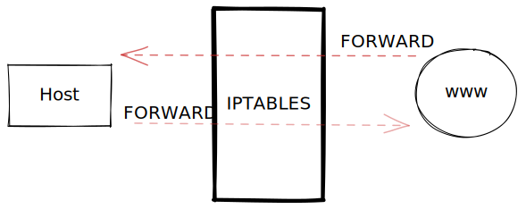

# ⛔ Hardening Linux

## IPTABLES

Iptables es una herramienta de filtrado de paquetes en Linux que permite a un administrador de sistemas configurar reglas de filtrado de paquetes IP del firewall del kernel de Linux.

> **IPTABLES se encarga de analizar cada paquete de tráfico de red entra en una máquina y decidir, en función de un conjunto de reglas, qué hacer con ese paquete**

Iptables se encuentra estructurado de la siguiente forma:

* Reglas
* Cadenas (INPUT, OUTPUT, FORWARD,etc)
* Tablas (FILTER, NAT, etc)

Dentro de las cadenas tenemos **INPUT** y **OUTPUT**, estas cadenas nos permite decidir que paquete entra y sale, estas 2 cadenas forman parte de la tabla **FILTER** que su nombre propio lo indica y se encarga de filtrar en base a la cadena que se le especifique.


Iptables por defecto toma la tabla `FILTER` en caso de que no se lo especifiquemos.&#x20;


#### Sintaxis de Iptables

```bash
iptables [-t tabla] -A/I cadena [opciones] -j acción
```

Cuando establecemos reglas en iptables la herramienta tiene un orden de lectura ascendente por lo que va leyendo las reglas de acuerdo al orden en que se agreguen. Para poder añadir una regla al principio o al final tenemos que especificarselo mediante la siguiente opcion:

`-A [APPEND]:` Esta opcion inserta la regla al final de la lista

`-I [INSERT]:` Esta opcion inserta la regla al principio


```bash
#Esta regla acepta los paquetes de entrada del protocolo SSH 
iptables -t filter -A INPUT -p ssh -j ACCEPT

#Al no poner -t, iptables automaticamente toma por referencia la tabla filter, con
# -i/-o especificamos la interfaz por donde entra/sale el paquete
iptables -A INPUT -i lo -j ACCEPT
iptables -A OUTPUT -o lo -j ACCEPT
```


#### Cadena FORWARD

Esta cadena permite el paso directo de los paquetes a traves del firewall



#### Tabla NAT

Existen 4 tipos mas de cadena para la tabla `NAT` en iptables:

\- `SNAT` \[->] - cuando el paquete sale desde la red interna hacia afuera

\- `DNAT` \[<-] - cuando el paquete llega desde internet hacia la red interna

> **SNAT transforms the source address of packets passing through the NAT device.**
>
> **DNAT transforms the destination address of packets passing through the Router**.
>
> SNAT is implemented after the routing decision is built (POSTROUTING). DNAT is implemented before the routing decision is built (PREROUTING)

\-`PREROUTING`: decision de enrutamiento al llegar el paquete al fw, va con `DNAT`

\-`POSTROUTING`: decision de enrutamiento al salir el paquete del fw, va con `SNAT`


&#x20;
