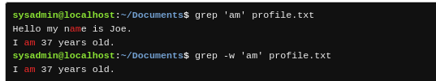

# Chapter 8: Regular Expressions

<details>

<summary>Key terms</summary>

<mark style="color:red;">**`egrep`**</mark> Commands that performs the same function as `grep -E` .This command has been deprecated, but is around for historical applications.

<mark style="color:red;">**`fgrep`**</mark> Command that performs the same function `grep -F`. This command has been deprecated.

<mark style="color:red;">**`grep`**</mark> Command used to print lines matching a specific pattern.

<mark style="color:red;">**`regex`**</mark>`(7)` Regular expression. This is a term used to describe a codified method of searching for text, or other strings in text.

<mark style="color:red;">**`sed`**</mark> A non-interactive editor that can be used to modify text

</details>

## Introduction

_Regular expressions (or regex)_ define a search pattern. They are similar to globbing in that they can be expanded to match certain sequences of characters in text, but have more variety and power.


A regex pattern is composed of literal characters and operators**.**


A _literal_ characters include letters, numbers, some punctuation characters, and basically any other character that is not an operator.

An operator is a special character or character sequence that has special meaning. Operators give regular expressions their superpowers!

> Operator are sometime referred to as metacharacters.

A regular expression has two commons forms: **basic and extended.** _Extended regular expressions_ support more operators than their basic counterparts. Most commands that can use regular expressions can interpret basic regular expressions.


The pattern **argument of a command should be protected by strong quotes** to prevent the shell from misinterpreting them as special shell characters. _This means that you should place single quotes `'` around a regular expression_


The man page for `regex` is a good source of information to learn about basic vs. extended regex, the syntax for regex, and regex compatibility.

## **Basic Regular Expressions**

The simplest of all regular expressions just use literal characters, such as alphanumeric characters. For example, to locate all lines of the `/etc/passwd` file that contain the expression `root` ,use the following command:

```bash
sysadmin@localhost:~$ grep 'root' /etc/passwd
root:x:0:0:root:/root:bin/bash
operator:x:11:0:operator:/root:/sbin/nologin
```

Although very useful for the <mark style="color:red;">**`grep`**</mark> command, literal characters alone provide no wildcarding or special matching capabilities. For that let's introduce **the **_**operators**_** that are available in basic regular expressions.**

| Basic Regex           | Operator                                        | Meaning                                                                                                                                                                                                                                                  |
| --------------------- | ----------------------------------------------- | -------------------------------------------------------------------------------------------------------------------------------------------------------------------------------------------------------------------------------------------------------- |
| Period operator       | `.`                                             | Matches any one single character.                                                                                                                                                                                                                        |
| List operator         | <p><code>[ ]</code></p><p><code>[^ ]</code></p> | Defines a list or range of literal characters that can match one character. **If the first character is the negation **<mark style="color:red;">**`^`**</mark>** operator, it matches any character that is not in the list.**                           |
| Asterisk operator     | `*`                                             | Matches zero or more instances of the previous character.                                                                                                                                                                                                |
| Front anchor operator | `^`                                             | If `^` is the first character in the pattern, then the entire pattern must be present at the beginning of the line to match. If <mark style="color:red;">`^`</mark> is not the first character, then it is treated as an ordinary literal `^` character. |
| Back anchor operator  | `$`                                             | If `$` is the last character in the pattern, then the pattern must be at the end of the line to match, otherwise, it is treated as a literal `$` character.                                                                                              |

### Anchoring

Anchoring is one of the ways regular expressions can be used to narrow search results.

**The front anchor** <mark style="color:red;">**`^`**</mark> **operator** can be used to ensure that **a pattern appears at the beggining of the line.**

```bash
grep ^root /etc/passwd
root:x:0:0:root:/root:bin/bash
```

**The back anchor **<mark style="color:red;background-color:blue;">**`$`**</mark> operator can be used to ensure **a pattern appears at the end of the line**, thereby effectively reducing the search results.

```bash
grep 'bash$' /etc/passwd
root:x:0:0:root:/root:/bin/bash
```


The position of the operator are important. The <mark style="color:red;">**`$`**</mark> operator must be the last character in the pattern in order to be effective as an anchor


If the <mark style="color:red;">**`^`**</mark> and <mark style="color:red;">**`$`**</mark> operators are used at the beggining and end of the same pattern, the entire line must match the pattern.

| Pattern         | Meaning                                                         |
| --------------- | --------------------------------------------------------------- |
| `^Hello`        | Matches any line that begins with the `Hello` string            |
| `World$`        | Matches any line that ends with the `World` string              |
| `^Hello World$` | Matches any line which matches the `Hello World` string exactly |

### Match a Single Character With <mark style="color:red;">`.`</mark>

It will match any character except for the new line character.&#x20;

The `r..t` pattern will find any line that contained the letter `r` followed by exactly two characters (can be any character) and then the letter `t`

 (1).png>)

```bash
sysadmin@localhost:~/Documents$ grep r..t red.txt
root
sysadmin@localhost:~/Documents$ grep r..f red.txt
reef
roof
sysadmin@localhost:~/Documents$ grep r..d red.txt
reed
read
sysadmin@localhost:~/Documents$ grep r.d red.txt
red
rod
```


The line doest not have to be an exact match, it simply must contain the pattern.


### Match a Single Character With `[]`&#x20;

The list <mark style="color:red;">**`[]`**</mark> operator works in regular expressions similar to how they work in glob expressions; **they match a single character from the list or range** of possible characters contained within the brackets.

For example to find all the lines that have numbers you can use the following:

.png>)


Do not mistake `[^0-9]` to match lines which do not contain numbers. It actually matches lines which contain non-number characters.


When other [regular expressions](chapter-8-regular-expressions.md#basic-regular-expressions) operators are placed inside of the list <mark style="color:red;">**`[]`**</mark> operators, they are treated as literal characters. For example, the `.` character normally matches any one character, but when placed inside the square brackets, then it will just match the `.` character itself. In the example, only lines which contain the literal `.` character are matched.

```bash
sysadmin@localhost:~/Documents$ cat profile.txt | grep [.]
Hello my name is Joe.
I am 37 years old.
My favorite food is avocados.
I have 2 dogs.
```

### Match a single character with `*`

The **asterisk** <mark style="color:red;">**`*`**</mark> **operator** is used to **match zero or more occurrences of the character preceding it**. For example, the `e*` pattern would match zero or more occurrences of the `e` character

```bash
sysadmin@localhost:~/Documents$ cat red.txt | grep 're*d'                       
red                                                                             
reeed                                                                           
rd                                                                              
reed 
```

It's also possible to match zero or more occurrences of a list of characters by utilizing the square brackets

```bash
sysadmin@localhost:~/Documents$ cat red.txt | grep 'r[oe]*d'                    
red                                                                             
reeed                                                                           
rd                                                                              
rod                                                                             
reed 
```


In order to make the asterisk <mark style="color:red;">**`*`**</mark> operator useful, it is necessary to create a pattern which includes more than just the one character preceding the asterisk `*` operator.


.png>)

| Pattern         | Meaning                                                                   |
| --------------- | ------------------------------------------------------------------------- |
| `abc*`          | Matches the `ab` string followed by zero or more `c` characters           |
| `a*`            | Matches zero or more occurrences of the `a` character                     |
| `aa*`           | Matches one or more occurrences of the `a` character                      |
| `[A-Z][aeiou]*` | Matches a single capital letter followed by zero or more vowel characters |

## Extended Regular Expressions

The use of extended regular expressions often requires a special option be provided to the command to recognize them.

Extended regular expression patterns support the basic regex operators PLUS the following additional operators:

| Extended Regex         | Operators | Meaning                                                                                   |
| ---------------------- | --------- | ----------------------------------------------------------------------------------------- |
| Grouping operator      | `( )`     | Groups characters together to **form a subpattern.**                                      |
| Asterisk operator      | `*`       | Previous character (or subpattern) is present **zero or more times**.                     |
| Plus operator          | `+`       | Previous character (or subpattern) is present **at least one or more times.**             |
| Question mark operator | `?`       | Previous character (or subpattern) is present **zero or one time** (but not more).        |
| Curly brace operator   | `{,}`     | **Specify minimum, maximum, or exact matches** of the previous character (or subpattern). |
| Alternation operator   | `\|`      | **Logical OR of choices**. For example, `abc\|def\|xyz` matches `abc` or `def` or `xyz`.  |

Historically, there is a command called <mark style="color:red;">**`egrep`**</mark>, which is similar to the <mark style="color:red;">**`grep`**</mark> command, but can understand extended regular expressions.


&#x20;Now the **** <mark style="color:red;">`egrep`</mark> **** command is deprecated in favor of using ** **<mark style="color:red;">**`grep`**</mark>** ** with **** the ** **<mark style="color:red;">**`-E`**</mark>** ** option**.**


### Grouping with `()`

The **grouping** <mark style="color:red;">**`()`**</mark> operator creates groupings that can be used for several purposes. At the most basic level, they are **used to group together characters that can be targeted by matching operators like `*`,`+`,`?`, or the curly braces **<mark style="background-color:red;">**`{ }`**</mark>**.**


This grouping is considered to be a subpattern of the pattern. A subpattern is a smaller pattern within a pattern.


In the example below, parentheses are used to match words beginning with `a` character, followed by the `dd` subpattern.

```bash
sysadmin@localhost:~/Documents$ cat words | grep -E '^a(dd)' | head             
add                                                                             
added                                                                           
addend                                                                          
addend's                                                                        
addenda                                                                         
addends                                                                         
addendum                                                                        
addendum's                                                                      
addendums                                                                       
adder  
```

### Match a Repeated Character with <mark style="color:red;">`+`</mark>

This **matches at least one of the previous characters, instead of zero**, so it is much more selective. For example, the `add+re` pattern would only match if the text contained one or more `d` characters, yielding the same results as the previously used dd\* pattern:

```bash
sysadmin@localhost:~/Documents$ cat words | grep -E '^add+re'                   
address                                                                         
address's                                                                       
addressable                                                                     
addressed                                                                       
addressee                                                                       
addressee's                                                                     
addressees                                                                      
addresses                                                                       
addressing
```

```bash
sysadmin@localhost:~/Documents$ cat red.txt | grep -E 'e+'
red
reef
reeed
reed
reel
read
sysadmin@localhost:~/Documents$ cat red.txt | grep -E 're+d'
red
reed
reed
```

In the example below, grouping is used in conjunction with the `+` operator to match the recurring `iss` subpattern:

```bash
sysadmin@localhost:~/Documents$ echo 'Miss Mississippi missed her mister.' | grep -E '(iss)+'
Miss Mississippi missed her mister.
```

| Pattern  | Meaning                                                              |
| -------- | -------------------------------------------------------------------- |
| `xyz+`   | Matches the `xy` string followed by one or more of the `z` character |
| `(xyz)+` | Matches one or more copies of the `xyz` string                       |

### Match an optional character with `?`

The extended regex question mark <mark style="color:red;">**`?`**</mark> operator **matches the preceding character or grouping zero or one times, making it optional**.

For example, consider the word "color" which can also be spelled with an optional `u` as "colour" . Use the `colou?r` pattern to match either spelling.

.png>)

| Pattern  | Meaning                                                              |
| -------- | -------------------------------------------------------------------- |
| `xyz?`   | Matches the `xy` string followed by zero or one of the `z` character |
| `x(yz)?` | Matches the `x` character followed by zero or one of the `yz` string |

### Match a repeated character with `{ }`

The extended regex curly **brace** <mark style="color:red;">**`{}`**</mark> operator is used to **specify the number of occurrences of the preceding character** or subpattern.

| Pattern  | Meaning                           |
| -------- | --------------------------------- |
| `a{0,}`  | Zero or more `a` characters       |
| `a{1,}`  | One or more `a` characters        |
| `a{0,1}` | Zero or one `a` characters        |
| `a{5}`   | Five `a` characters               |
| `a{,5}`  | Five or fewer `a` characters      |
| `a{3,5}` | From three to five `a` characters |

To demonstrate, the <mark style="color:red;">**`{ }`**</mark> operator in action, the example below matches two to three instances of the letter `r` in the words.txt

```bash
sysadmin@localhost:~/Documents$ cat words | grep -E 'r{2,3}' | head -n 3        
Aguirre                                                                         
Aguirre's                                                                       
Andorra
```

### Comparing Quantifiers

The `*`, `+`, `?`, and `{ }` characters are considered to be quantifying operators. The curly braces `{ }` can be used instead of the other quantifiers. The following chart illustrates some examples of using curly braces:

| Pattern                                                 | Meaning                                                                      |
| ------------------------------------------------------- | ---------------------------------------------------------------------------- |
| <p><code>xyz*</code></p><p><code>xyz{0,}</code></p>     | Matches the `xy` string followed by zero or more of the `z` character        |
| <p><code>x(yz)*</code></p><p><code>x(yz){0,}</code></p> | Matches the `x` character followed by zero or more copies of the `yz` string |
| <p><code>xyz+</code></p><p><code>xyz{1,}</code></p>     | Matches the `xy` string followed by one or more of the `z` character         |
| <p><code>(xyz)+</code></p><p><code>(xyz){1,}</code></p> | Matches one or more copies of the `xyz` string                               |
| <p><code>xyz?</code></p><p><code>xyz{0,1}</code></p>    | Matches the `xy` string followed by zero or one of the `z` character         |
| `xyz{,5}`                                               | Matches the `xy` string followed by five or fewer of the `z` character       |
| `xyz{5,}`                                               | Matches the `xy` string followed by five or more of the `z` character        |
| `xyz{3,5}`                                              | Matches the `xy` string followed by three to five of the `z` character       |
| `[0-9]{1,3}%`                                           | Matches one to three numeric characters, followed by the `%` character       |

### Match Subpatterns with `|`

When used in extended regular expressions, the alternation <mark style="color:red;">**`|`**</mark> operator **separates alternative expressions that can match. It acts similarly to a Boolean **_**OR**_

To match both the word gray or grey, use the expressions `gray|grey`

```bash
sysadmin@localhost:~/Documents$ grep -E 'gray|grey' spelling.txt
American English: Do you consider gray to be a color or a shade?
British English: Do you consider grey to be a colour or a shade?
```

**Parentheses can also be used with alternation**. The previous example of `gray|grey` could be rewritten as `gr(a|e)y`.&#x20;


When parentheses are used in regular expressions from the command line, remember to enclose them in the single quotes to prevent the shell from interpreting themas


```bash
sysadmin@localhost:~/Documents$ grep -E 'gr(a|e)y' spelling.txt
American English: Do you consider gray to be a color or a shade?
British English: Do you consider grey to be a colour or a shade?
```

| Pattern                                                  | Meaning                                                           |
| -------------------------------------------------------- | ----------------------------------------------------------------- |
| `abc\|xyz`                                               | Matches the `abc` string or the `xyz` string                      |
| <p><code>ab(c|d|e)</code></p><p><code>ab[cde]</code></p> | Matches the `ab` string followed by a `c` or `d` or `e` character |

## Using Special Regular Expression Sequences

In basic regular expressions **putting a backslash `\` character in front of another character means to match that character literally**. For example, matching the `.` character with the `\.` pattern is appropiate.

However, the backslash `\` character can also be used for designated backslash character combinations, called _backslash sequences._&#x20;

> Backslash sequences can represent special operators or character classes.

| Backslash Sequence | Pattern Equivalent | Matches                          |
| ------------------ | ------------------ | -------------------------------- |
| `\b`               |                    | Word boundary operator           |
| `\B`               |                    | Not a word boundary operator     |
| `\w`               | `[A-Za-z0-9]`      | Word character class             |
| `\W`               | `[^A-Za-z0-9]`     | Not a word character class       |
| `\d`               | `[0-9]`            | Digit character class            |
| `\s`               |                    | Whitespace character class       |
| `\S`               |                    | Not a whitespace character class |
| `\\`               |                    | Literal backslash character      |

Take in consideration that words in files don't always have whitespace around them, sometimes there are commas or other punctuation marks before or after a word. Problems like the following may occur if the word boundary operator is not used:

```bash
sysadmin@localhost:~/Documents$ echo 'This is useful' | sed 's/is/was/'
Thwas is useful
```


Recall that to do a simple search and replace operation with the **`sed`** command, use the following script, or expression:

```
s/PATTERN/REPLACEMENT/
```

In the syntax above, the `s`character signifies _substitution_ and the forward slash `/` character is used as a delimiter.


It would be better to use the `\bis\b` search criteria(_the "is" pattern with word boundaries around it_) to match the word is

```bash
sysadmin@localhost:~/Documents$ echo 'This is useful' | sed 's/\bis\b/was/'
This was useful
```

To delete certain text, the <mark style="color:red;">`sed`</mark> command can be used to remove characters defined within square brackets.

For example, if you wanted to delete the leading numbers in the `animals.txt` file and create a new file without the numbers, you could use the `sed` command and define the range `0-9` to be removed:

```bash
sysadmin@localhost:~/Documents$ cat animals.txt
1 retriever
2 badger
3 bat
4 wolf
5 eagle
sysadmin@localhost:~/Documents$ sed 's/[0-9]//g' animals.txt > newanimals.txt
sysadmin@localhost:~/Documents$ cat newanimals.txt
 retriever
 badger
 bat
 wolf
 eagle
```


**Consider this**

In some commands, **parentheses can be used for referring back to what was matched**. What was matched by the first set of parentheses can be referred to as `\1`, the second as `\2`, and so on.


```bash
sysadmin@localhost:~/Documents$ cat people.csv
Dennis,Richie
Andrew,Tanenbaum
Ken,Thompson
Linus,Torvalds
sysadmin@localhost:~/Documents$ sed -r 's/(\w+),(\w+)/\2, \1/' people.csv
Richie, Dennis
Tanenbaum, Andrew
Thompson, Ken
Torvalds, Linus
```

The <mark style="color:red;">`-r`</mark> option to the `sed`command indicates the use of extended regular expressions.

## Escaping especial characters with <mark style="color:red;">`\`</mark>

In some cases, you may want to match a character that functions as an operator as a literal character.

For example, the asteriks `*` character functions as an operator, so searching for the `re*` pattern matches every line which contain an `r` character, followed by zero or more of the `e` character (which means it matches any line containing an `r` character)

.png>)

But what if we want to search for a literal asterisk `*` character? **In basic regular expressions, the backslash `\` character is as an **_**escape character**_ ,meaning the character inmediatly following it will be interpreted as a literal character instead of an operator.

To look for a literal asterisk `*` character, escape it by placing a backslash `\` character before the `*` character.

```bash
sysadmin@localhost:~/Documents$ grep 're\*' newhome.txtas
```

 (1).png>)

## The Realm of Basic Regular Expresssions

When you use the <mark style="color:red;">`grep`</mark> command without the <mark style="color:red;">`-E`</mark> option, **you are using regular expressions. In this realm**, basic operators are interpreted as basic operators. And ,as seen in the preceding examples, escaping a basic operator (placing a `\` character in front of it) forces it to be interpreted as a literal character.

In the realm of basic regular expressions, the extended regular expression operators do not have special meaning; they are interpreted as literal characters.&#x20;

| Not Escaped                                                | Escaped   |           |
| ---------------------------------------------------------- | --------- | --------- |
| <p>Basic Operators</p><p><code>. [ ] ^ * ^ $</code></p>    | Operators | Literal   |
| <p>Extended Operators</p><p><code>? + { } | ( )</code></p> | Literal   | Operators |

## The Real of Extended Regular Expressions

When the `grep -E` or `egrep` commands are used, you are in the realm of extended regular expressions. This means all regular expression operators (both basic and extended) are interpreted as operators.

| Not Escaped                                                | Escaped   |         |
| ---------------------------------------------------------- | --------- | ------- |
| <p>Basic Operators</p><p><code>. [ ] ^ * ^ $</code></p>    | Operators | Literal |
| <p>Extended Operators</p><p><code>? + { } | ( )</code></p> | Operators | Literal |

## Using the `fgrep` command

If the entire pattern uses no special characters and you need to use a backslash to escape the special meaning of characters, then you should use the fixed strings grep <mark style="color:red;">`fgrep`</mark> command. **The **<mark style="color:red;">**`fgrep`**</mark>** command always treats its pattern as literal characters,** so you don't have to use the backslash to escape the regex characters.

.png>)

## Options for the `grep` command

The man page for the <mark style="color:red;">`grep`</mark> command provides basic information about regular expressions, as well as options for the <mark style="color:red;">`grep`</mark>, <mark style="color:red;">`egrep`</mark>, and <mark style="color:red;">`fgrep`</mark> commands. The following table lists some of the more commonly used options

| Option                               | Meaning                                                                                                         |
| ------------------------------------ | --------------------------------------------------------------------------------------------------------------- |
| <mark style="color:red;">`-i`</mark> | Case insensitive                                                                                                |
| <mark style="color:red;">`-v`</mark> | Invert search results (logically negates criteria) - returns all lines that don't contain the specified pattern |
| <mark style="color:red;">`-l`</mark> | List the file name of content in file matches                                                                   |
| <mark style="color:red;">`-r`</mark> | Perform a recursive search including subdirectories                                                             |
| <mark style="color:red;">`-w`</mark> | Match whole word only                                                                                           |
| <mark style="color:red;">`-q`</mark> | Quietly operate without producing output                                                                        |

When using the <mark style="color:red;">**`-w`**</mark> **option**, **the expression must match a complete word**. This is similar to the word boundary regular expression that was previously mentioned.



## Using `grep` to Search Multiple Files

The <mark style="color:red;">`grep`</mark> command can search multiples files if a glob character is used for the files names. The following command will search all of the files in the current directory for the "Linux" pattern.

```bash
sysadmin@localhost:~/Documents$ grep 'Linux' ./*
grep: ./School: Is a directory
grep: ./Work: Is a directory
./linux.txt:Linux       is      growing !
./linux.txt:Linux   is      growing !
./linux.txt:Linux       is      growing !
./linux.txt:Linux       is      growing !
./os.csv:1991,Linux,Torvalds
./words:Linux
./words:Linux's
```

Rather than displaying every line in every file that matches the pattern, it may be preferable to see a list of the file names that have at least one line that matches the pattern. The <mark style="color:red;">**`-l`**</mark> option will list file names that contain matches, rather than the matches themselves:

 (1).png>)

Using the <mark style="color:red;">**`-r`**</mark> **option will allow for directory searches to be recursive,** rather than just the files in the current directory.

```bash
sysadmin@localhost:~/Documents$ grep -lr 'Linux' ./*                            
./School/Art/linux.txt                                                          
./linux.txt                                                                     
./os.csv                                                                        
./words                                                                         
```
