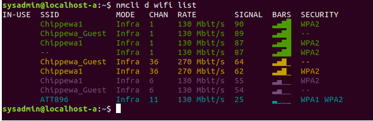

# Chapter 16: The Boot Process

## Intro

It is very important to understand this process, in order to be able to fix boot problems when they occur and for modifying system states called _runlevels_ or on **systemd** devices, targets.

The boot process takes places in 4 main stages:

* Firmware Stage
* Bootloader
* Kernel Stage
* Init Stage



## Firmware Stage

At this point, the computer has power but needs to start executing some software that will eventually get a full kernel booted.


Most PC firmware is referred to as the **Basic Input/Output System (BIOS)**. The BIOS is stored on the motherboard in non-volatile memory such as Read Only Memory (ROM) or flash memory.


The BIOS has three main jobs to perform as part of the first stage of the boot process:

1. Execute a _power-on-self test_ (POST) in order to ensure the hardware of the system is functioning properly. The POST runs some basic functional checks on the CPU, memory, and peripherals so that obvious errors are found early in the boot cycle.
2. Enumerate available hardware such as memory, disks and USB devices.
3. Find the proper boot drive from the available storage devices and load the **MASTER BOOT RECORD (MBR)** from that device. The MBR is the first sector of the disk.

## Bootloader Stage

The **Master Boot Record (MBR)** cotains a partition table and a very small amount of executable code. The bootloader will perform several operations, but the <mark style="color:red;">primary task is to load the Linux Kernel into memory and execute it.</mark>

The most common bootloader used on machines is the **Grand Unifier Bootloader (GRUB)**. The latest version of GRUB supports booting Linux from a system using UEFI.


**UEFI** systems give the firmware stage a lot more memory and capabilities.


It is also possible to boot off the network through the **Preboot Execution Environment (PXE).** In the PXE system, a compatible motherboard and network card contain enough intelligence to acquire an address from the network and use the **Trivial File Transfer Protocol (TFTP)** to download a special bootloader from a server.

As a bootloader is just some software that gets a kernel to run, it is possible to boot multiple operating systems at different times off of one computer in a process known as _dual_ or _multi-booting._

GRUB provides a reasonably powerful command line interface that lets an administrator make changes to the kernel before it boots without requiring that the configuration be written to disk.

The bootloader then loads the kernel from disk into memory and transfers control over. The system is now running Linux and may finish booting.

## Kernel Stage

Now that the bootloader has loaded the kernel into memory, the kernel must initialize any hardware drivers and get the root `/` filesystem mounted for the next stage.

The kernel itself is laid out much like a regular executable except that it must be self-contained. This kernel typically lives in the `/boot` partition which, on most hardware, is in a separate partition that's kept close to the beginning of the hard drive.&#x20;

The `/boot`directory, alternatively the `/boot/efi` ,is one of the most important directories in the File Hierarchy System (FHS).&#x20;


You may hear the term _**bootstrap** _ used in this context, which signifies the **method for the computer BIOS to locate and load** the first part of the OS when the computer powers up.


As the size of the kernel increased over time, developers found it better to compress the kernel to make it fit within the limitations of the BIOS. Leading to the name of <mark style="color:red;">`zImage`</mark>for the Kernel, with the letter `z`being associated with the `zlib`Unix compression library.

Over time, the kernel grew even more in size, and it became a problem to load the whole kernel into a consecutive block of memory. The <mark style="color:red;">`bzImage`</mark>kernel format came into being that allowed the kernel to be loaded into multiple memory blocks.

**The Linux kernel must mount the root filesystem in order to get to the next step and to make the system useful**. However, it is possible that the root filesystem exists on a device that the kernel does not know how to support. The solution to this is the initial RAM disk <mark style="color:red;">`initrd`</mark>`.`

The kernel drivers necessary to continue the boot are bundled into the filesystem that is stored beside the kernel itself in `/boot`.The kernel boots, mounts the <mark style="color:red;">`initrd`</mark>,loads the drivers inside, and then remounts the real root filesystem using new drivers.&#x20;

The kernel final job is to start the first process on the system. The first process will normaly have a process ID (PID) of 1; on a **System V** system, the name of this process is <mark style="color:red;">`init`</mark>


On **systemd** systems, the `/sbin/init` file is a symbolic link to the `/usr/lib/systemd/systemd` file for purposes of compatibility.


To show the first process, `init`, execute the `ps` command using the following non-BSD options, which will show all processes running on a system in a hierarchical format

```bash
sysadmin@localhost:~$ ps -ejH
  PID  PGID   SID TTY          TIME CMD
    1     1     1 ?        00:00:00 init
   32    32    32 ?        00:00:00   rsyslogd
   37    37    37 ?        00:00:00   cron
   39    39    39 ?        00:00:00   sshd
   56    56    56 ?        00:00:00   named
   69     1     1 ?        00:00:00   login
   79    79     1 ?        00:00:00     bash
  676   676     1 ?        00:00:00       ps
```

In some cases, such as embedded hardware, the `init` process could be a shell or a specialized daemon. In any case, this first process will start the daemons that the rest of the system will use.

## The init Stage

The init stage finishes booting the system. The first process of the operating system (also called `init`) is started.&#x20;

The <mark style="color:red;">`init`</mark> process has 3 important responsabilities:

* Continue the booting process to get services running, login screens displaying, and consoles listening.
* Start all other system processes
* Adopt any process that detaches from its parent

The actual process that is executed is the <mark style="color:red;">`init`</mark> process. Recently, other programs have emerged to compete with and replace the traditional <mark style="color:red;">`init`</mark> <mark style="color:red;"></mark><mark style="color:red;"></mark> process with **Upstart** and **systemd.+**

### **`init`**

If the system uses the traditional <mark style="color:red;">`init`</mark> <mark style="color:red;"></mark><mark style="color:red;"></mark> program, then the `/etc/inittab`file is used to determine what scripts will be executed to start the services that will be available on the system.

* The `inittab` file points to other scripts that do the work, usually stored in the `/etc/init.d` directory.

### `Upstart`

If the traditional `init` has been replaced with **Upstart**, the scripts in the `/etc/init` directory are used to complete system initialization.

### `systemd`

If the traditional `init` has been replaced with the **systemd**, then the files in the `/etc/systemd` directory are used for starting up and running the system.


Even if your system is using **Systemd** or **Upstart** as a replacement for the traditional `init` process, both replacements use an executable named init with the `/sbin/init` path name.


## initramfs

**The **<mark style="color:red;">**`initramfs`**</mark><mark style="color:red;">** **</mark><mark style="color:red;">****</mark>** is the **_**initial**_** root filesystem that a Linux system typically has access to**. Think of it as a temporary "_starter_" filesystem that provides the files and drivers that are necessary to start the real root filesystem and continue the system startup.


**Consider this**

<mark style="color:red;">**User space**</mark> <mark style="color:red;"></mark><mark style="color:red;">and</mark> <mark style="color:red;"></mark><mark style="color:red;">**kernel space**</mark> <mark style="color:red;"></mark><mark style="color:red;">are two regions of RAM that the Linux Kernal manages.</mark> Programs running in Kernel space have access to all the regions of RAM and when a program requests access to something, the kernel will access it in a safe manner and return the information to the program.

User space has restrictions, programs running there cannot access all of the kernel space RAM or RAM used by other programs, all access to those regions must be made via system calls and be managed by the kernel


**The `initramfs` is a **<mark style="color:red;">**`cpio`**</mark><mark style="color:red;">** **</mark><mark style="color:red;">****</mark>** archive**, which can be inserted into a certain spot in the kernel, whose contents are unpacked by the kernel and loaded into a RAM disk by the kernel for access.

The kernel will note the `initramfs`` `<mark style="color:red;">`cpio`</mark> <mark style="color:red;"></mark><mark style="color:red;"></mark> archive has contents, **create a temporary filesystem RAM disk called `tmpfs`** ,and unpack the contents of the `cpio` archive into it.

After begin unpacked, the kernel will launch the `init` script included in the root `/` filesystem of the initramfs RAM disk, which will then load the necessary drivers and execute the required userspace programs needed to load the real root filesystem for the system.

After this, it transfers control the `/sbin/init` binary program on the real root filesystem to continue the initialization of the system.

Once the kernel is fully booted and the real root filesystem is mounted, the memory allocated to the initial RAM disk can be freed.

> This is the main advantage of placing drivers in `initramfs` instead of compiling them into the kernel.

The initramfs is built initially with the <mark style="color:red;">`mkinitramfs`</mark> utility, or updated by the <mark style="color:red;">`update-initramfs`</mark> utility, which can also create new initramfs. **These commands will gather the needed files and userspace utilities from their installed locations to a temporary directory**.

## Kernel Messages

The <mark style="color:red;">`dmesg`</mark> command can be executed after booting the system to see the messages generated by the kernel during boot time.

Kernel messages are stored in a ring buffer of limited size. It is possible that some of the kernel messages generated at boot time may be stored in the `/var/log/dmesg` file.&#x20;

It is common to execute the `dmesg` command upon connecting a new device to the system. This allows the administrator to see how the kernel dealt with the new device and usually to see what path name the new device has been asigned.

```bash
sysadmin@localhost:~$ dmesg | tail -n 20
[5974251.345037] br0: port 2(veth2) entered forwarding state
[5974264.554578] br0: port 1(vxlan1) entered forwarding state
[5974266.346778] br0: port 2(veth2) entered forwarding state
[5974312.446398] br0: renamed from ov-0044a8-d8912
[5974312.686393] vxlan1: renamed from vx-0044a8-d8912
```

## The `/var/log/messages` file

Kernel messages and other system-related messages are typically stored in the `/var/log/messages` file. This file, which is considered the main log file, is alternatively name `/var/log/syslog` in some distributions.&#x20;

The primary log file is updated with the new log entries by the combination of the `syslogd` and `klogd` daemons. Replacements for these daemons include `rsyslogd` and `syslog-ng` daemons.


A daemon is a process that automatically runs as a background process.

System logging daemons such as `syslogd`, `klogd`, `rsyslogd`, and other logging daemons are background processes that send system messages to log files.


On a systemd-based system, <mark style="color:red;">**the journald daemon is the logging mechanism**</mark>, and it's configured by the `/etc/systemd/journald.conf` file. The format of a journald log file is binary.&#x20;

```
[root@centos ~]# cat /etc/systemd/journald.conf
#Seal=yes
#SplitMode=uid
#SyncIntervalSec=5m
#RateLimitInterval=30s
#RateLimitBurst=1000
```

The main log file on a systemd-based device is the `/var/log/journal` file for persistent logging or the `/run/log/journal` file for RAM-based and non-persistent logging.

The journald log files are viewed with the `journalctl` command.

```
[root@centos ~]# journalctl -b
-- Logs begin at Tue 2019-06-04 16:21:58 UTC, end at Tue 2019-06-04 16:26:25 UTC
Jun 04 16:21:58 centos systemd-journal[84]: Runtime journal is using 4.0M (max a
Jun 04 16:21:58 centos kernel: Initializing cgroup subsys cpuset
Jun 04 16:21:58 centos kernel: Initializing cgroup subsys cpu
```

The `-b` option makes the `journalctl` command behave similarly to the `dmesg` command, by displaying only messages concerning the most recent bootup, which can be useful for troubleshooting issues regarding the boot process.

## Key Terms

#### /etc/inittab&#x20;

Configuration file read by init when it starts up to determine what process to start for various run levels.

#### SysVinit&#x20;

The traditional service management package for Linux, containing the init program (the first process that is run when the kernel has finished initializing) as well as some infrastructure to start and stop services and configure them.

#### UEFI&#x20;

The Unified Extensible Firmware Interface (UEFI) is system firmware. UEFI uses a special partition on a drive called an EFI System Partition to store the bootloader for an OS.

#### init&#x20;

The parent of all processes on the system, it is executed by the kernel and is responsible for starting all other processes.

#### journalctl&#x20;

The log file viewer for binary log files.

#### systemd

&#x20;A full replacement for init with parallel starting of services and other features, used by many distributions.
